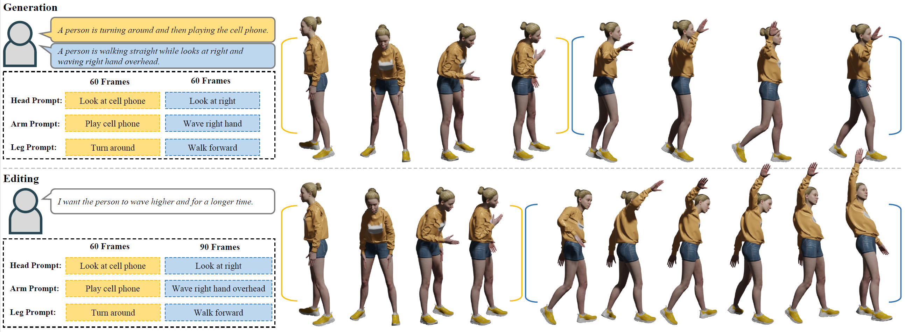
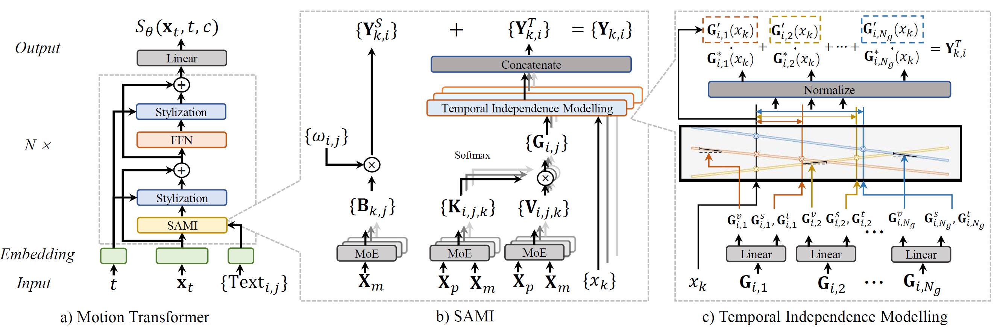

<div align="center">

<h1>FineMoGen: Fine-Grained Spatio-Temporal Motion Generation and Editing</h1>

<div>
    <a href='https://mingyuan-zhang.github.io/' target='_blank'>Mingyuan Zhang</a><sup>1</sup>&emsp;
    <a href='https://www.linkedin.com/in/huirong-li/' target='_blank'>Huirong Li</a><sup>1</sup>&emsp;
    <a href='https://caizhongang.github.io/' target='_blank'>Zhongang Cai</a><sup>1,2</sup>&emsp;
    <a href='https://jiawei-ren.github.io/' target='_blank'>Jiawei Ren</a><sup>1</sup>&emsp;
    <a href='https://yanglei.me/' target='_blank'>Lei Yang</a><sup>2</sup>&emsp;
    <a href='https://liuziwei7.github.io/' target='_blank'>Ziwei Liu</a><sup>1+</sup>
</div>
<div>
    <sup>1</sup>S-Lab, Nanyang Technological University&emsp;
    <sup>2</sup>SenseTime Research&emsp;
</div>
<div>
    <sup>+</sup>corresponding author
</div>


---

<h4 align="center">
  <a href="https://mingyuan-zhang.github.io/projects/FineMoGen.html" target='_blank'>[Project Page]</a> •
  <a href="https://openreview.net/pdf?id=GYjV1M5s0D" target='_blank'>[PDF]</a>  <br> <br>
  Accepted to <a href="https://nips.cc/" target="_blank"><strong>NeurIPS 2023</strong></a></h2>
  
</h4>

</div>


>**Abstract:** Text-driven motion generation has achieved substantial progress with the emergence of diffusion models. However, existing methods still struggle to generate complex motion sequences that correspond to fine-grained descriptions, depicting detailed and accurate spatio-temporal actions. This lack of fine controllability limits the usage of motion generation to a larger audience. To tackle these challenges, we present **FineMoGen**, a diffusion-based motion generation and editing framework that can synthesize fine-grained motions, with spatial-temporal composition to the user instructions. To facilitate a large-scale study on this new fine-grained motion generation task, we also contribute the **HuMMan-MoGen** dataset, which contains fine-grained description for each body part and each action stage.

<div align="center">
<tr>
    
    
</tr>
</div>

>**Pipeline Overview:** FineMoGen builds upon diffusion model with a novel transformer architecture dubbed Spatio-Temporal Mixture Attention (**SAMI**). SAMI optimizes the generation of the global attention template from three perspectives: 1) **Temporal Independence**: we regard each global template as a time-varied signal, which allows us to extrapolate the feature refinement between different time intervals. 2) **Spatial Independence**: we manually divide the raw motion data into several body parts, process them independently in FFN modules and apply sptial refinement in SAMI modules. 3) **Sparsely-Activated Mixture-of-Expert**: we broaden the overall network structure to enhance learning capability and overcome the training difficulties brought by spatial-temporal independence modelling.

## Updates

[12/2023] Release code for [FineMoGen](https://mingyuan-zhang.github.io/projects/FineMoGen.html), [MoMat-MoGen](https://digital-life-project.com/), [ReMoDiffuse](https://mingyuan-zhang.github.io/projects/ReMoDiffuse.html) and [MotionDiffuse](https://mingyuan-zhang.github.io/projects/MotionDiffuse.html)

## Benchmark and Model Zoo

#### Supported methods

- [x] [MotionDiffuse](https://mingyuan-zhang.github.io/projects/ReMoDiffuse.html)
- [x] [MDM](https://guytevet.github.io/mdm-page/)
- [x] [ReMoDiffuse](https://mingyuan-zhang.github.io/projects/MotionDiffuse.html)
- [x] [MoMat-MoGen](https://digital-life-project.com/)
- [x] [FineMoGen](https://mingyuan-zhang.github.io/projects/FineMoGen.html)


## Citation

If you find our work useful for your research, please consider citing the paper:

```
@article{zhang2023finemogen,
  title={FineMoGen: Fine-Grained Spatio-Temporal Motion Generation and Editing},
  author={Zhang, Mingyuan and Li, Huirong and Cai, Zhongang and Ren, Jiawei and Yang, Lei and Liu, Ziwei},
  journal={NeurIPS},
  year={2023}
}
@article{zhang2023remodiffuse,
  title={ReMoDiffuse: Retrieval-Augmented Motion Diffusion Model},
  author={Zhang, Mingyuan and Guo, Xinying and Pan, Liang and Cai, Zhongang and Hong, Fangzhou and and Yang, Lei and Liu, Ziwei},
  journal={arXiv preprint arXiv:2304.01116},
  year={2023}
}
@article{zhang2022motiondiffuse,
  title={MotionDiffuse: Text-Driven Human Motion Generation with Diffusion Model},
  author={Zhang, Mingyuan and Cai, Zhongang and Pan, Liang and Hong, Fangzhou and Guo, Xinying and Yang, Lei and Liu, Ziwei},
  journal={arXiv preprint arXiv:2208.15001},
  year={2022}
}
```

## Installation

```shell
# Create Conda Environment
conda create -n mogen python=3.9 -y
conda activate mogen

# C++ Environment
export PATH=/mnt/lustre/share/gcc/gcc-8.5.0/bin:$PATH
export LD_LIBRARY_PATH=/mnt/lustre/share/gcc/gcc-8.5.0/lib:/mnt/lustre/share/gcc/gcc-8.5.0/lib64:/mnt/lustre/share/gcc/gmp-4.3.2/lib:/mnt/lustre/share/gcc/mpc-0.8.1/lib:/mnt/lustre/share/gcc/mpfr-2.4.2/lib:$LD_LIBRARY_PATH

# Install Pytorch
conda install pytorch==1.12.1 torchvision==0.13.1 torchaudio==0.12.1 cudatoolkit=11.3 -c pytorch -y

# Install MMCV
pip install "mmcv-full>=1.4.2,<=1.9.0" -f https://download.openmmlab.com/mmcv/dist/cu113/torch1.12.1/index.html

# Install Pytorch3d
conda install -c bottler nvidiacub -y
conda install -c fvcore -c iopath -c conda-forge fvcore iopath -y
conda install pytorch3d -c pytorch3d -y

# Install tutel
python3 -m pip install --verbose --upgrade git+https://github.com/microsoft/tutel@main

# Install other requirements
pip install -r requirements.txt
```

## Data Preparation

Download data files from google drive [link](https://drive.google.com/drive/folders/1utEV_NTZ14tDFPG20bGmbSRmjizCVKxF?usp=sharing). Unzipped all files and arrange them in the following file structure:

```text
FineMoGen
├── mogen
├── tools
├── configs
├── logs
│   ├── finemogen
│   ├── motiondiffuse
│   ├── remodiffuse
│   └── mdm
└── data
    ├── database
    ├── datasets
    ├── evaluators
    └── glove
```

## Training

### Training with a single / multiple GPUs

```shell
PYTHONPATH=".":$PYTHONPATH python tools/train.py ${CONFIG_FILE} ${WORK_DIR} --no-validate
```

**Note:** The provided config files are designed for training with 8 gpus. If you want to train on a single gpu, you can reduce the number of epochs to one-fourth of the original.

### Training with Slurm

```shell
./tools/slurm_train.sh ${PARTITION} ${JOB_NAME} ${CONFIG_FILE} ${WORK_DIR} ${GPU_NUM} --no-validate
```

Common optional arguments include:
- `--resume-from ${CHECKPOINT_FILE}`: Resume from a previous checkpoint file.
- `--no-validate`: Whether not to evaluate the checkpoint during training.

Example: using 8 GPUs to train ReMoDiffuse on a slurm cluster.
```shell
./tools/slurm_train.sh my_partition my_job configs/finemogen/finemogen_kit.py logs/finemogen_kit 8 --no-validate
```

## Evaluation

### Evaluate with a single GPU / multiple GPUs

```shell
PYTHONPATH=".":$PYTHONPATH python tools/test.py ${CONFIG} --work-dir=${WORK_DIR} ${CHECKPOINT}
```

### Evaluate with slurm

```shell
./tools/slurm_test.sh ${PARTITION} ${JOB_NAME} ${CONFIG} ${WORK_DIR} ${CHECKPOINT}
```
Example:
```shell
./tools/slurm_test.sh my_partition test_finemogen configs/finemogen/finemogen_kit.py logs/finemogen/finemogen_kit logs/finemogen/finemogen_kit/latest.pth
```

**Note:** Run full evaluation for HumanML3D dataset is very slow. You can change `replication_times` in [human_ml3d_bs128.py](configs/_base_/datasets/human_ml3d_bs128.py) to $1$ for a quick evaluation.

## Visualization

### Visualization for a single motion

```shell
PYTHONPATH=".":$PYTHONPATH python tools/visualize.py ${CONFIG} ${CHECKPOINT} \
    --text ${TEXT} \
    --motion_length ${MOTION_LENGTH} \
    --out ${OUTPUT_ANIMATION_PATH} \
    --device cpu
```

Example:
```shell
PYTHONPATH=".":$PYTHONPATH python tools/visualize.py \
    configs/remodiffuse/remodiffuse_t2m.py \
    logs/finemogen/finemogen_t2m/latest.pth \
    --text "a person is running quickly" \
    --motion_length 120 \
    --out "test.gif" \
    --device cpu
```

### Visualization for temporal composition

```shell
PYTHONPATH=".":$PYTHONPATH python tools/visualize.py ${CONFIG} ${CHECKPOINT} \
    --text ${TEXT1} ${TEXT2} ${TEXT3} ... \
    --motion_length ${MOTION_LENGTH1} ${MOTION_LENGTH2} ${MOTION_LENGTH3} ... \
    --out ${OUTPUT_ANIMATION_PATH} \
    --device cpu
```

Example:
```shell
PYTHONPATH=".":$PYTHONPATH python tools/visualize.py \
    configs/finemogen/finemogen_t2m.py \
    logs/finemogen/finemogen_t2m/latest.pth \
    --text "a person walks 4 steps forward" "a person stops and looks around" "a perons sits down" "a person cries" "a person jumps backward"  \
    --motion_length 60 60 60 60 60 \
    --out "test.gif"
```

## Acknowledgement

This study is supported by the Ministry of Education, Singapore, under its MOE AcRF Tier 2 (MOE-T2EP20221-0012), NTU NAP, and under the RIE2020 Industry Alignment Fund – Industry Collaboration Projects (IAF-ICP) Funding Initiative, as well as cash and in-kind contribution from the industry partner(s).

The visualization tool is developed on top of [Generating Diverse and Natural 3D Human Motions from Text](https://github.com/EricGuo5513/text-to-motion)
